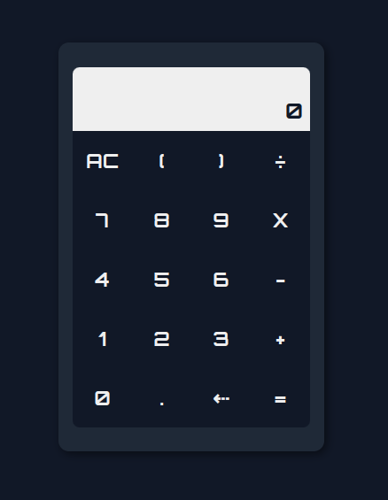

# GCalc - Calculadora Simples em React

GCalc é um projeto de uma calculadora simples em React, criada pelo usuário Guilherme-Silva0. Esta calculadora pode ser utilizada para realizar operações básicas, tais como adição, subtração, multiplicação e divisão.

## Funcionalidades

- Adição (+)
- Subtração (-)
- Multiplicação (\*)
- Divisão (/)

## Como Usar

1. Faça o download do projeto em seu computador ou clone o repositório usando o seguinte comando:

```
git clone https://github.com/Guilherme-Silva0/GCalc.git
```

2. Abra o terminal no diretório do projeto e execute o seguinte comando para instalar as dependências:

```
npm install
```

3. Em seguida, execute o seguinte comando para iniciar a aplicação:

```
npm start
```

4. A aplicação será aberta em seu navegador no endereço [http://localhost:3000](http://localhost:3000). Insira os números que deseja calcular usando o teclado da calculadora ou o teclado do seu computador. Clique no botão correspondente à operação que deseja realizar. O resultado da operação será exibido na tela.

## Contribuindo

Se desejar contribuir com o projeto, você pode abrir uma issue ou enviar um pull request. Toda ajuda é bem-vinda!

## Licença

Este projeto está sob a licença MIT. Veja o arquivo [LICENSE](https://github.com/Guilherme-Silva0/GCalc/blob/main/LICENSE) para mais detalhes.

## Screeshots

- Tela inicial:
  

## Tecnologias Utilizadas

O projeto GCalc foi criado utilizando as seguintes tecnologias:

- React
- JavaScript
- HTML
- CSS
- MathJS

## Estrutura do Projeto

A estrutura de arquivos do projeto é a seguinte:

```
GCalc/
├── public/
│ ├── index.html
│ └── ...
├── src/
│ ├── App.js
│ ├── index.js
│ └── ...
├── package.json
└── LICENSE
```

- `public/`: diretório que contém os arquivos públicos da aplicação, como o arquivo HTML principal.
- `src/`: diretório que contém os arquivos do código-fonte da aplicação.
- `App.js`: arquivo que contém o componente principal da aplicação.
- `index.js`: arquivo que contém o código para renderizar a aplicação na página.
- `package.json`: arquivo que contém as dependências e scripts do projeto.
- `LICENSE`: arquivo que contém a licença do projeto.

## Autor

O GCalc foi criado por Guilherme-Silva0.

## Agradecimentos

- Obrigado à equipe do GitHub por fornecer uma plataforma incrível para hospedar projetos de código aberto.
- Obrigado aos desenvolvedores das tecnologias utilizadas neste projeto.
